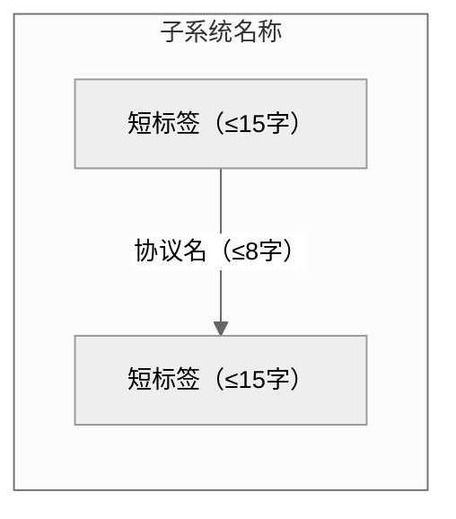
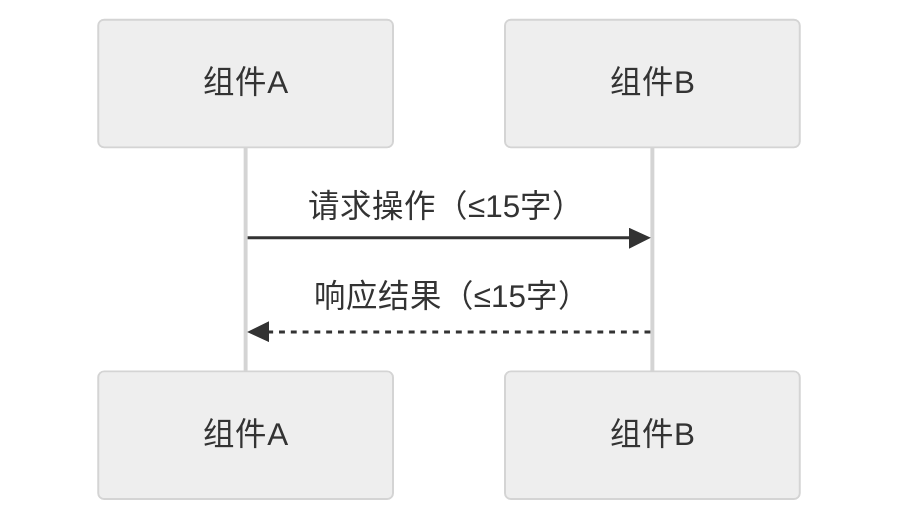
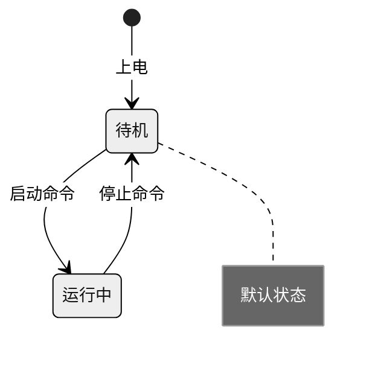
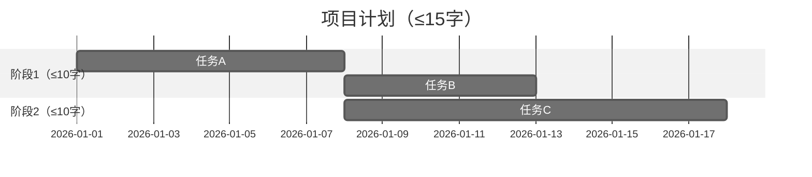
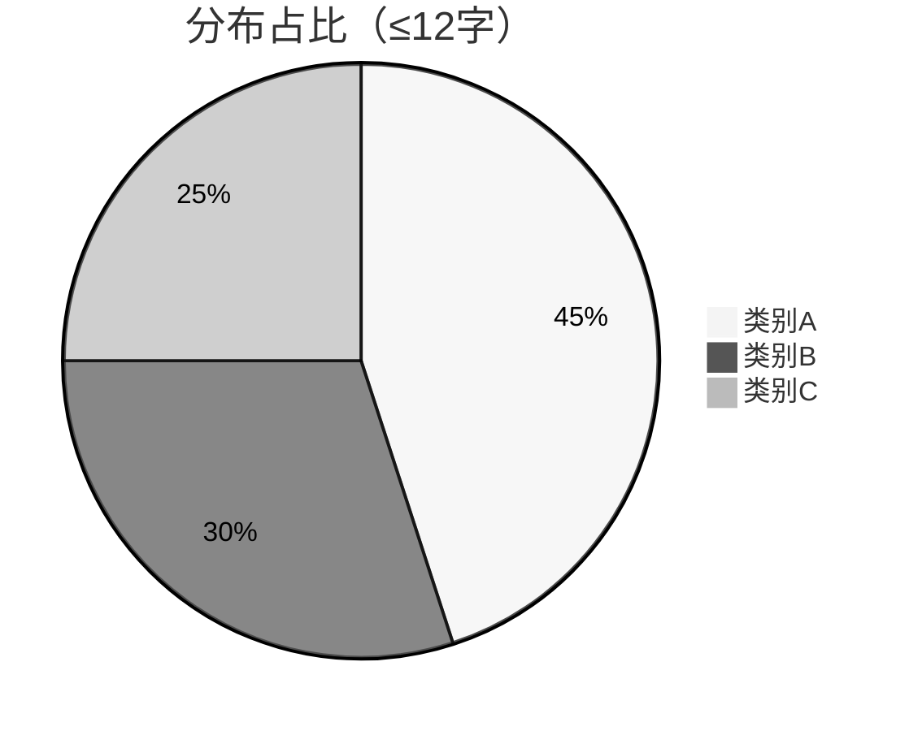

# Mermaid 图生成规范 — Word 文档交付级

**核心交付标准**：生成的 Mermaid 图通过 Pandoc filter 渲染为 docx 后，必须满足：
1. **一眼看懂** — 字体清晰可读，信息密度合理
2. **不跨 A4 页** — 单张图渲染宽度 ≤ 680px，节点数 ≤ 上限
3. **无人值守通过** — 不需要手动调整，Pandoc filter 一步完成

**约束层级说明**：
- **MUST** — 违反将导致 docx 不可用（排版溢出 / 字体不可读）
- **SHOULD** — 强烈推荐，违反将降低可读性
- **MAY** — 可选项，根据场景决定

---

## 渲染环境假设

本规范假设使用以下工具链之一将 Mermaid 代码渲染为 docx 内嵌图片：

| 方案 | 推荐场景 | Mermaid 版本 |
|------|---------|-------------|
| Pandoc + pandoc-mermaid-filter | 批量转换 Markdown to docx | filter 底层 mmdc 版本 |
| Typora File to Export to Word | 单文档手动导出 | 内置 Mermaid 8.x |
| mermaid-cli (mmdc) + 手动引用 PNG | 需要最大控制力 | 最新版 (~10.x) |

**本规范的语法规则以 Pandoc filter 方案为主目标**，同时向后兼容 Typora 8.x。如果你使用 mmdc 10.x+ 直接渲染，flowchart 关键字可以安全使用——但如果你不确定，**始终用 graph**。

---

## Word 文档排版约束（MUST — 最高优先级）

以下约束是 **硬性上限**，违反任意一条将导致 docx 不可用。

### 图表尺寸 MUST

| 参数 | 值 | 原因 |
|------|-----|------|
| 渲染宽度上限 | **≤ 680px** | A4 页宽 794px，减去标准边距后可用宽度 ~680px |
| 渲染高度上限 | **≤ 900px** | A4 页高 1123px，减去边距后可用高度 ~900px（一页） |
| PNG 分辨率 | **≥ 150 DPI** | 确保插入 Word 后不模糊（Word 默认 96 DPI，150 为安全余量） |
| 背景色 | **白色 (#FFFFFF)** | Word 文档标准背景；neutral 主题自然输出白底 |

### 每图节点上限 MUST

| 图表类型 | 最大节点数 | 原因 |
|----------|-----------|------|
| graph LR（横向流程） | **≤ 8** | 超过 8 个节点横向排列会超出 680px |
| graph TB（纵向层级） | **≤ 6 层** | 超过 6 层可能超出 900px |
| sequenceDiagram | **≤ 6 个 participant** | 每个 participant 占用 ~100px 列宽 |
| stateDiagram | **≤ 8 个状态** | 状态节点较大，8 个为安全上限 |
| gantt | **≤ 10 个任务行** | 超过 10 行高度可能溢出 |
| pie | **≤ 6 个分块** | 超过 6 块标签拥挤不可读 |

### 拆分规则 MUST

**当内容超过以上任一上限时，MUST 拆分为多张图，而不是缩小或压缩。**

拆分原则：
1. 按**逻辑阶段**拆分（如：阶段1-初始化、阶段2-主流程、阶段3-异常处理）
2. 主图给整体概览（≤5 个顶层节点），子图给每个阶段的细节
3. 拆分的图用编号标注：图1：系统初始化流程、图2：主业务处理流程

### 字体可读性 MUST

Mermaid 图渲染为 PNG 后插入 Word，字体大小取决于渲染宽度和节点文字量：

- 每个节点 ≤ **15 个中文字**（或 30 个英文字符）
- 箭头标签 ≤ **8 个中文字**
- subgraph 标题 ≤ **10 个中文字**

---

## 语法兼容性规则（MUST / SHOULD）

以下规则基于 Mermaid 8.x~10.x 实战验证。如果目标渲染环境（Pandoc filter 所用 Mermaid 版本）≥ 10.x，部分历史限制可放宽。**但为安全起见，以下规则均视为 MUST，除非你已确认目标 Mermaid 版本。**

### 核心语法禁用表

| # | 禁止写法 | 强制替代 | 层级 | 原因 |
|---|---------|---------|------|------|
| 1 | flowchart LR/TD/TB | graph LR/TD/TB | MUST | Mermaid < 9.0 不支持 flowchart 关键字 |
| 2 | direction TB/LR 在 subgraph 内 | 删除该行 | MUST | 子图内方向指令跨版本不稳定 |
| 3 | Node --> SubgraphID / SubgraphID --> Node | Node --> FirstNodeInSubgraph | MUST | 子图 ID 不能作箭头端点（所有版本） |
| 4 | A <-- "text" --> B | A <--> |"text"| B | MUST | 双向箭头标注语法有限制 |
| 5 | A --- B | A --> B（或改用 -...-> 虚线） | SHOULD | --- 可能与 YAML 分隔符混淆 |
| 6 | classDef / class ... default | 用 %%{init: {...}}%% 控制全局样式 | SHOULD | classDef 在某些渲染器配置下不稳定 |
| 7 | 节点标签不引号 [text] / {text} | ["text"] / {"text"} | SHOULD | 含特殊字符(() _)时不引号会报错 |

### 每个图块的首行模板 MUST

```
%%{init: {'theme': 'neutral', 'themeVariables': {'fontSize': '14px'}}}%%
```

**说明**：
- neutral 输出白底 + 黑框 + 深色文字，适合 Word 文档
- fontSize: 14px 确保 680px 宽度下文字可读
- 此行 MUST 紧跟 graph / sequenceDiagram / stateDiagram / gantt / pie 声明

---

## 设计规则

### 1. 布局方向 SHOULD

| 场景 | 方向 | 原因 |
|------|------|------|
| 横向流程/架构（默认） | graph LR | 利用 A4 宽度，避免纵向溢出 |
| 深层次树/多子图嵌套 | graph TB | 横向放不下时才用纵向 |
| 时序图 | sequenceDiagram | 天然纵向，不可改变 |

```
graph LR  （默认首选）
graph TB  （仅当 LR 放不下时）
flowchart LR  （MUST NOT — 兼容性）
```

### 2. 节点文字 MUST

- 每个节点 ≤ **15 个中文字**
- 用 `·` 分隔并列项，`/` 分隔替代项
- 所有节点标签 MUST 加引号：["text"] / {"text"}
- 形状语义：
  - ["..."] 矩形 = 普通节点/组件
  - {"..."} 菱形 = 判断/分支
  - (["..."]) 圆角 = 开始/结束
  - [("...")] 圆柱 = 数据库/存储

```
A["固件升级·FTP下载"]
C{"upgrade_mgt_flag==1?"}
```

### 3. 层次结构 MUST

- subgraph 嵌套 ≤ **2 层**
- 子图内 MUST NOT 使用 direction

```
subgraph A → subgraph B  （2 层嵌套）
subgraph A → subgraph B → subgraph C  （3 层 — 排版溢出风险）
```

### 4. 连接规则 MUST

- 子图之间 MUST NOT 直接互连；通过子图内具体节点建立连接
- 箭头标签 ≤ **8 个中文字**

```
subgraph A ... end; subgraph B ... end; A --> B
subgraph A: N1["节点1"]; subgraph B: N2["节点2"]; N1 --> N2
N1 -->|"eSPI"| N2
MCU <-->|"CABI SPI"| SIO
```

### 5. 颜色与对比度 MUST

- 背景：白底（通过 theme: 'neutral' 确保）
- 文字：深色（neutral 主题默认）
- MUST NOT 使用自定义颜色除非确有必要
- 如需区分模块：用 style 指令仅改填充色，不改文字色

```
%% 仅当需要区分模块时
style N1 fill:#e8f4fd   （浅蓝底，深色字不受影响）
```

---

## 标准模板

### graph（架构/流程图）



### sequenceDiagram（时序图）



### stateDiagram（状态机）



### gantt（甘特图）



**gantt 约束**：≤ 10 行任务，≤ 3 个 section，title ≤ 15 字。超过则拆分。

### pie（饼图）



**pie 约束**：≤ 6 个分块，各块标签 ≤ 8 字，title ≤ 12 字。超过则考虑用表格替代。

---

## 常见错误 — 及修正

| 错误 | 修正 | 为什么错 |
|------|------|---------|
| 一张图塞 15 个节点 | 拆成主图（5 节点概览）+ 子图（7 节点细节） | 15 节点在 680px 宽度下不可读 |
| graph LR 下用 10 个横向节点 | 改为 graph TB 或拆成两张 LR 图 | 每个节点 ~80px，10 个 = 800px > 680px |
| 节点文字超过20字 | 拆成多个短节点 | 20 字在 14px 字体下溢出节点框 |
| 用 flowchart 而非 graph | 用 graph | Pandoc filter 底层 Mermaid 版本不确定 |
| 渲染出图后插入 Word 发现字太小 | 确保 fontSize: 14px + 宽度 ≤ 680px | 默认字号在缩放到 A4 宽度后可能只有 8px |
| 子图嵌套 3 层导致布局混乱 | 扁平化为 2 层或拆成独立图 | Mermaid 的 subgraph 渲染在嵌套多层时不可靠 |

---

## 代理防理性化表（当你试图跳过规则时）

| 你想说的 | 实际真相 |
|----------|----------|
| "这张图节点少，多塞一个没事" | 每个节点 ~80px 宽，超出 680px = 截断。MUST 遵守上限。 |
| "字体可以小一点，Word 里放大就行" | PNG 是位图，放大 = 模糊。150 DPI + 14px 是最低保障。 |
| "我用 flowchart 应该没问题" | 你无法确认目标环境 Mermaid 版本。用 graph 是唯一安全选择。 |
| "这个 subgraph 嵌套 3 层也能看" | 在你的本机渲染也许能看，但 Pandoc filter 的 Mermaid 版本可能渲染成另一副样子。 |
| "这些规则太多了，我跳过几个" | 每条规则都对应一个已发生的 docx 交付事故。跳过 = 制造事故。 |
| "先出图再说，排版问题后面改" | 排版问题的修复成本 = 重新生成图 + 重新转 docx。现在花 30 秒检查，省下 10 分钟返工。 |

## 红牌信号 — STOP 并重新检查

- 节点数超过上限，但你"觉得能放下"
- 节点文字超过 15 字，但你"缩一缩就行"
- 想用 flowchart 替代 graph
- "我用过 flowchart，没出过问题"
- 拆分后你只给了 1 张图但原始需求明显需要 2 张以上

**以上任一出现 → 回到本规范顶部，逐条检查。不要妥协。**

---

## 自检清单（逐项确认，不可跳过）

### 第一层：排版硬约束（任一违反 = docx 不可用）

- [ ] 渲染宽度 ≤ 680px（或已确认 Mermaid 渲染器不会超宽）
- [ ] 节点数 ≤ 对应类型上限（graph ≤8, sequence ≤6, state ≤8, gantt ≤10, pie ≤6）
- [ ] 所有节点标签 ≤ 15 中文字 / 30 英文字符
- [ ] 所有箭头标签 ≤ 8 中文字
- [ ] 如超过任一上限，已拆分为多张图并有编号标注
- [ ] %%{init: {'theme': 'neutral', 'themeVariables': {'fontSize': '14px'}}}%% 存在于每个图块首行

### 第二层：语法兼容性（任一违反 = 可能渲染失败）

- [ ] 使用 graph 而非 flowchart
- [ ] 无 direction 在 subgraph 内
- [ ] 箭头端点均为节点 ID（非子图 ID）
- [ ] 节点标签用 ["..."] / {"..."} 引号包裹
- [ ] 无 <<-->> / <-- "text" --> 写法
- [ ] 无 classDef / class ... default 指令
- [ ] 无 --- 连线（用 --> 替代）

### 第三层：可读性（任一违反 = 降低专业度）

- [ ] 子图嵌套 ≤ 2 层
- [ ] 图表类型有对应的标准模板
- [ ] 背景白色、文字深色、对比度清晰
- [ ] 拆分后的多张图之间有逻辑关联，读者可追踪

---

> **交付前确认**：这三层全部勾选后，才可以执行 pandoc ... -t docx 转换。不要跳过任何一项。
